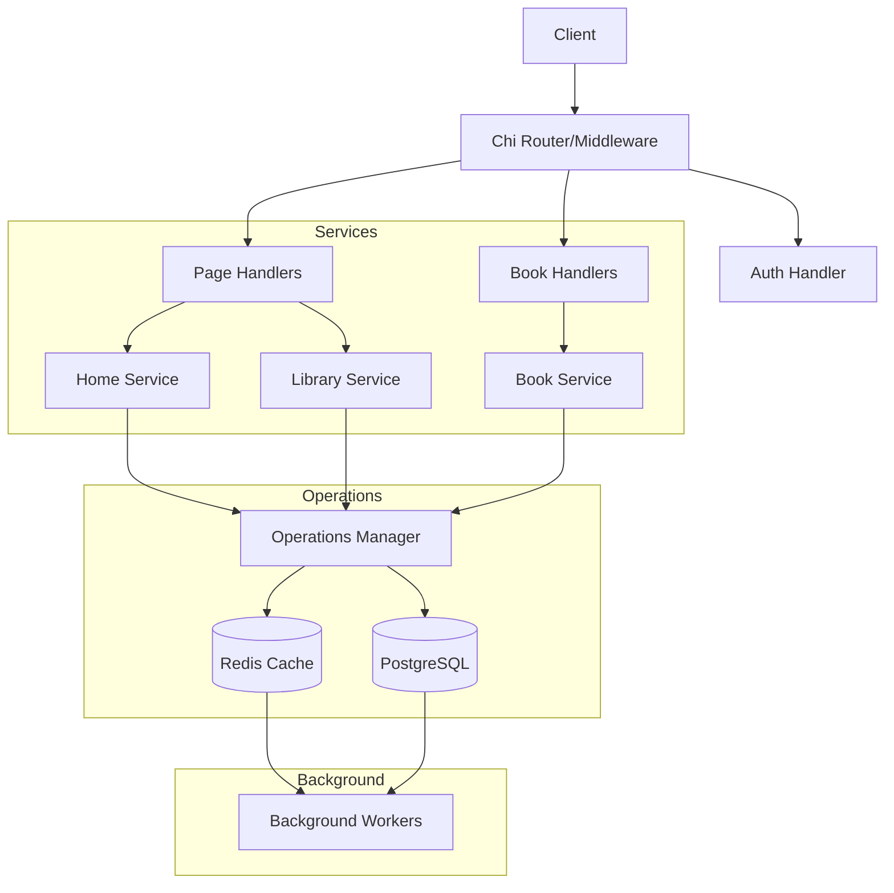

## Overview

Q-KO is a "collector's companion" media management and billing tool designed for gamers, film enthusiasts, and avid readers. It tracks and manages metadata and associated expenses for physical and digital media collections, currently supporting games and books.

## Table of Contents

- [Overview](#overview)
- [System Architecture](#system-architecture)
  - [Modular Monolith Design](#modular-monolith-design)
- [Core Components](#core-components)
  - [Backend Architecture](#backend-architecture-go)
- [Scalability & Extensibility](#scalability--extensibility)
  - [Architectural Design for Scale](#architectural-design-for-scale)
  - [System Diagram](#system-diagram)
  - [Performance Optimizations](#performance-optimizations)
- [Data Flow](#data-flow)
  - [Request Handling](#request-handling)
  - [Business Logic](#business-logic)
  - [Data Access](#data-access)
  - [Caching Strategy](#caching-strategy)
- [Security Measures](#security-measures)
  - [Authentication & Authorization](#authentication--authorization-auth0)
  - [Application Security](#application-security-internal)
  - [API Security](#api-security-external)
- [Testing Strategy](#testing-strategy)
  - [Backend Testing](#backend-testing)
  - [Frontend Testing](#frontend-testing)
- [Monitoring and Observability](#monitoring-and-observability)
  - [Performance Metrics](#performance-metrics)
  - [Health Monitoring](#health-monitoring)
  - [Structured Logging](#structured-logging)
- [Development Workflow](#development-workflow)
  - [Version Control](#version-control)
  - [CI/CD Pipeline](#cicd-pipeline)
  - [Documentation](#documentation)

## System Architecture

### Modular Monolith Design

1. **Development Efficiency**
   - Single source of truth for code and configuration
   - Simplified dependency management
   - Unified tooling and development workflow
   - Centralized API contract management

2. **Operational Benefits**
   - Synchronized frontend and backend changes in single commits
   - Streamlined CI/CD pipeline
   - Consistent deployment strategy

3. **Technical Advantages**
   - Shared type definitions
   - Consistent API contracts
   - Unified domain models

## Core Components

The modular structure above enables Q-KO's scalable architecture.

### Backend Architecture (Go)

```text
.
backend/
├── cmd/                    # Application entrypoints
│   └── api/                # API server binary
│       └── main.go         # Entry point
├── config/                 # Configuration files
├── db/                     # Database related
│   ├── migrations/         # Database migrations
│   └── seeds/              # Seed data
├── server/                 # HTTP server package
│   ├── server.go           # Server definition
│   ├── routes.go           # Route configuration
│   └── tests/              # HTTP endpoint tests
└── internal/               # Private application code
    ├── books/              # Books domain module
    ├── core/               # Core business logic
    │   ├── models/         # Domain models
    │   ├── services/       # Business services
    │   └── repositories/   # Data access
    └── shared/             # Shared internal utilities
        ├── cache/          # Caching logic
        ├── crypto/         # Cryptography utilities
        ├── database/       # Database utilities
        ├── http/           # HTTP utilities
        ├── jwt/            # JWT handling
        ├── logger/         # Logging
        ├── middleware/     # Application middleware (including auth)
        ├── redis/          # Redis client
        ├── types/          # Common types
        └── validator/      # Input validation
```

### Database Architecture (PostgreSQL)

Q-KO uses PostgreSQL as its primary data store, chosen for its:

1. **Data Integrity**
   - ACID compliance for transaction reliability
   - Strong data consistency guarantees
   - Rich constraint system for data validation

2. **Performance Features**
   - Advanced indexing capabilities
   - Efficient query planning
   - Connection pooling support
   - Concurrent access optimization

3. **Scalability Support**
   - Partitioning for large datasets
   - Replication capabilities
   - JSON support for flexible schema evolution
   - Full-text search functionality

4. **Development Experience**
   - Migrations-based schema management
   - Comprehensive SQL feature set
   - Rich ecosystem of tools and extensions
   - Strong type system alignment with Go

### Frontend Architecture (React)

```text
frontend/
├── src/
│ ├── components/ # Reusable UI components
│ ├── features/ # Feature-specific modules
│ ├── hooks/ # Custom React hooks
│ ├── services/ # API integration
│ └── utils/ # Shared utilities
└── public/ # Static assets
```

The frontend architecture emphasizes maintainability, performance, and developer experience through carefully selected technologies and patterns:

1. **State Management**
   - Zustand for lightweight, scalable state management
   - Reduced boilerplate compared to Redux while maintaining predictable state flows
   - Type-safe store definitions and actions

2. **Data Fetching & Cache Management**
   - TanStack Query (React Query) for server state management
   - Optimistic updates for improved UX
   - Automatic background refetching
   - Smart cache invalidation strategies
   - Type-safe API integration with backend contracts

3. **UI Component Strategy**
   - Material UI for consistent, professional design language
   - Emphasis on accessibility and responsive design
   - Performance-optimized component rendering

## Scalability & Extensibility

These scalability patterns inform our data flow design:

### Architectural Design for Scale

1. **Modular Domain Extension**
   - Designed for multi-domain support (books, music, movies)
   - Domain-specific modules with shared core infrastructure
   - Factory pattern initialization enables seamless domain addition
   ```go
   // Example domain registration in factory.go
   bookDomainHandler := domains.NewBookDomainHandler(bookHandlers, log)
   operationsManager.RegisterDomain(bookDomainHandler)
   ```

2. **Layered Service Architecture**
   ```
   Request Flow:
   Handler → Service → Operations → Repository
   └── Validation
   └── Caching
   └── Authentication
   ```

3. **Resource Management**
   - Graceful shutdown coordination
   - Connection pooling for database access
   - Redis caching with invalidation strategies
   - Worker pool management for background tasks

### System Diagram


### Performance Optimizations

1. **Multi-Level Caching**
   - Redis for distributed caching
   - In-memory caching for frequent operations
   - Cache invalidation workers for consistency

2. **Request Processing**
   - Rate limiting by operation type
   ```go
   r.With(middleware.StandardRateLimiter).Get("/books")
   r.With(middleware.IntensiveRateLimiter).Get("/search")
   ```
   - Adaptive compression for large responses
   - Request validation pipeline

3. **Resource Management**
   - Connection pooling
   - Prepared statement caching
   - Graceful shutdown coordination
   ```go
   func gracefulShutdown(ctx context.Context, srv *http.Server, f *Factory, app *application, log *slog.Logger) error {
       // Coordinated shutdown sequence
       // 1. Stop accepting new requests
       // 2. Complete in-flight requests
       // 3. Close background workers
       // 4. Close database connections
   }
   ```

## Data Flow

1. **Request Handling**
   - JWT-based authentication
   - Request validation
   - Rate limiting
   - CORS policy enforcement

2. **Business Logic**
   - Domain-driven design principles
   - Service layer abstraction
   - Strong type safety

3. **Data Access**
   - Repository pattern
   - Connection pooling
   - Prepared statements
   - Transaction management

4. **Caching Strategy**
   - Redis for frequently accessed data
   - Cache invalidation policies
   - Cache-aside pattern implementation

## Security Measures

### Authentication & Authorization (Auth0)

1. **Identity & Access Management**
   - Frontend authentication via Auth0 SPA SDK
   - Backend validation via Auth0 JWT middleware
   - OAuth 2.0 and OpenID Connect compliance
   - Social login integration

2. **Security Features**
   - MFA support
   - Secure session management with refresh tokens (frontend)
   - Role-based access control (backend)
   - Token validation and scope checking (backend)

### Application Security (Internal)

1. **Request Protection**
   - CSRF protection via gorilla/csrf
   - Rate limiting
   - Input validation and sanitization
   - Secure headers management via chi middleware

2. **Data Security**
   - SQL injection prevention through prepared statements
   - Audit logging of authentication events
   - Sensitive data encryption
   - Error handling security

### API Security (External)

1. **Access Control**
   - Secure cookie handling
   - API rate limiting
   - Request validation middleware
   - CORS policy enforcement via chi middleware

2. **API Hardening**
   - Request throttling
   - API versioning
   - Response sanitization
   - Security headers enforcement

## Testing Strategy

### Backend Testing

1. **Test Types**
   - Unit tests with `testify`
   - Integration tests
   - API endpoint tests
   - Performance benchmarks

### Frontend Testing

1. **Test Types**
   - Unit tests with Jest
   - Component tests with React Testing Library


## Monitoring and Observability

1. **Performance Metrics**
   - Cache hit/miss ratios
   - Request latencies
   - Worker queue depths
   ```go
   metrics := f.CacheManager.GetMetrics()
   log.Info("Cache metrics",
       "totalOps", metrics.TotalOps,
       "l1Failures", metrics.L1Failures,
       "l2Failures", metrics.L2Failures,
   )
   ```

2. **Health Monitoring**
   - Component health checks
   - Resource utilization tracking
   - Error rate monitoring

3. **Structured Logging**
   - Request tracing
   - Error tracking
   - Performance monitoring

## Development Workflow

1. **Version Control**
   - Feature branch workflow
   - Conventional commits
   - Pull request templates
   - Code review guidelines

2. **CI/CD Pipeline**
   - Automated testing
   - Code quality checks
   - Security scanning
   - Automated deployments

3. **Documentation**
   - API documentation (OpenAPI/Swagger)
   - Component documentation
   - Architecture decisions records (ADRs)