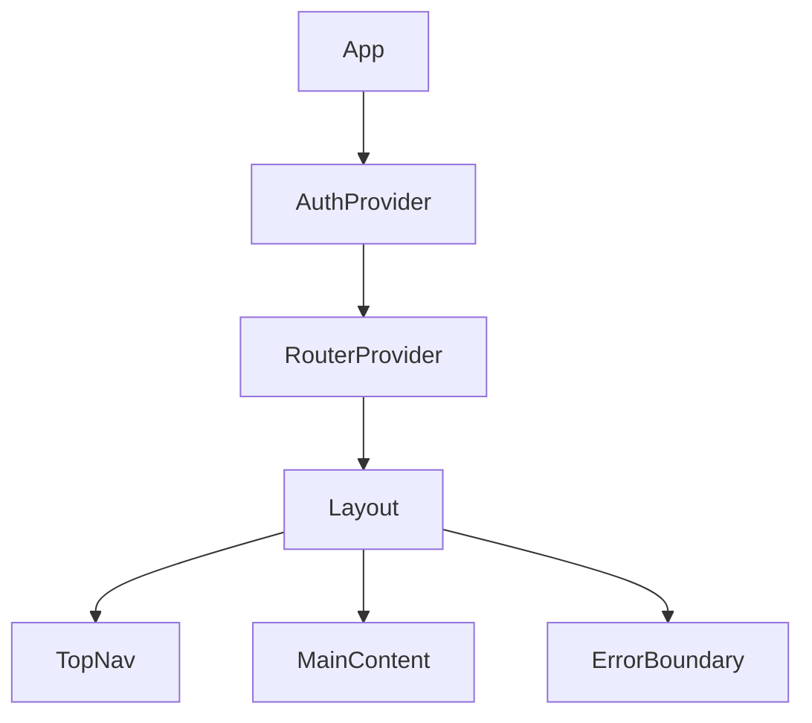
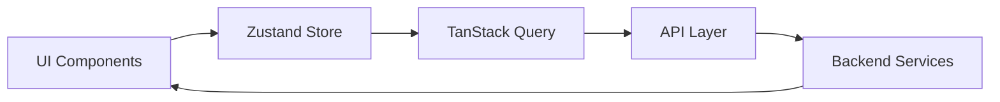

# 2. Frontend Architecture Setup

Date: 2024-12-20
Author: A.M. Loke

## Status
Accepted

## Context
Building a modern, responsive Single Page Application (SPA) for book/game management that needs to:
- Provide an intuitive user interface
- Support responsive design across devices
- Maintain consistent state management
- Enable comprehensive testing
- Handle errors gracefully

## Decision
Implement a React-based architecture with the following key components:

### 1. Core Technology Stack
- TypeScript + Vite + React for development
- MaterialUI (MUI) for component framework
- Zustand for client state management
- TanStack Query for server state
- Axios for HTTP requests

### 2. Architecture Overview

#### Component Hierarchy

#### Data Flow

### 3. Key Implementation Patterns
- Feature-based architecture
- Atomic design methodology
- Error boundary implementation
- Responsive layout design
- Performance optimization
- Automated testing

## Rationale
- TypeScript: Type safety and developer experience
- Vite: Fast development and build times
- MUI: Production-ready components and responsive design
- Zustand: Minimal boilerplate and efficient state management
- TanStack Query: Robust data fetching and caching

## Consequences

### Positive
- Type-safe development
- Consistent development patterns
- Efficient state management
- Comprehensive testing capabilities

### Negative
- Initial setup complexity
- Learning curve for team
- Bundle size considerations

### Mitigations
- Comprehensive documentation
- Performance optimization strategies
- Developer onboarding guides

## References
[Technical Documentation](../technical/)
[Developer Guides](../guides/)