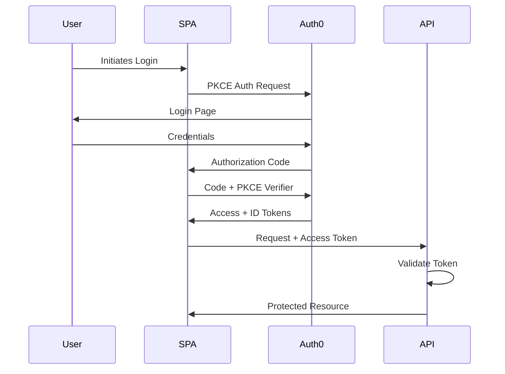
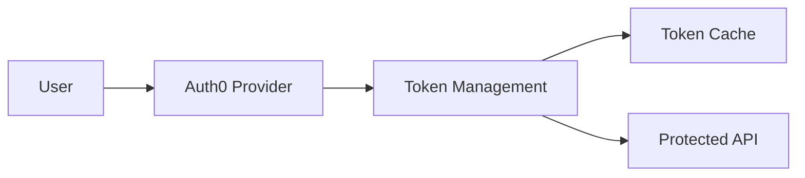

# 3. Auth0 Authentication Implementation

Date: 2025-1-31
Author: A.M. Loke

## Status
Proposed

## Context
Need to implement a secure and user-friendly authentication system.

Requirements:
- Enterprise-level security that protects user data and access
- Support for multiple login methods (email, social logins, etc.)
- Fast and reliable performance
- Industry-standard security practices
- Smooth user experience during login/logout

## Decision
Use Auth0 as authentication service.

### 1. System Architecture

#### Authentication Flow


#### Data Flow


### 2. Core Components

#### User Authentication
- Secure login service
- Industry-standard security protocol
- Secure session management
- Automatic session renewal
- Error handling and recovery

#### Security Features
- Advanced security verification
- Multiple security checks
  - Verify request source
  - Validate request destination
  - Check security timeouts
- Permission management
  - User-specific permissions
  - Role-based access
  - API access control
- Security rotation
- Request limiting

#### Performance Features
- 'Smart' Storage System
  - Stores security data locally for 24 hours
  - Pre-loads security checks
  - Limits requests to 100 per minute
  - Manages connections efficiently
  - Loads security features only when needed

### 3. Main Implementation Patterns

#### Frontend
- Security wrapper for the application
- Protected page access
- Request security checks
- Error handling systems
- Login state tracking

#### Backend
- Security check system
- Secure data storage
- Flexible security validation
- Security settings management

### 4. Security Settings

#### Security Token Management
- Short-lived access (1 hour)
- Longer-lived backup access (14 days, auto-rotating)
- User identity confirmation (1 hour)
- Advanced security verification method

#### Security Headers
We'll use industry-standard security headers to protect our application. These will be configured according to OWASP security best practices.

#### Request Limits
To prevent system abuse, we'll implement the following limits:
- Login attempts: 10 per minute
- Security refreshes: 30 per minute
- API requests: 100 per minute

### 5. System Monitoring

#### Metrics
- Security Events
  - Login successes and failures
  - Security refresh patterns
  - Request limit warnings
- Performance Measurements
  - Security check speed
  - System efficiency
  - Response times

#### Error Monitoring
We track problems with:
- Login failures
- Security verification issues
- Request limit reaches
- Network problems
- System access issues

## Auth0 Rationale
Selected Auth0 because it provides:
- Enterprise-grade security
- Many authentication options
- Great developer tools
- Clear documentation
- Strong community
- Industry security compliance

## Consequences

### Positive
- Industry-standard security
- Multiple login options
- Faster development
- Built-in monitoring
- Room to grow

### Negative
- Depends on external service
- Additional costs
- Possible delays
- Setup complexity

### Mitigations
- Build backup systems
- Optimize performance
- Monitor everything
- Create backup login methods
- Detailed error handling

## Technical Implementation

For specific technical implementation details, please refer to our internal documentation:
- Frontend setup guide: `/docs/frontend/auth-setup.md`
- Backend setup guide: `/docs/backend/auth-setup.md`
- Security configuration: `/docs/security/auth-config.md`

## Implementation Notes

### Frontend Configuration
```typescript
const auth0Config = {
    domain: process.env.AUTH0_DOMAIN,
    clientId: process.env.AUTH0_CLIENT_ID,
    audience: process.env.AUTH0_AUDIENCE,
    redirectUri: window.location.origin,
    useRefreshTokens: true,
    cacheLocation: 'localstorage',
    tokenPreFetch: true
}
```

### Backend Configuration
```go
type Auth0Config struct {
    Domain      string
    Audience    string
    JWKSCache   time.Duration
    RateLimit   rate.Limit
    Timeout     time.Duration
    RetryPolicy RetryConfig
}
```


## References
- [Auth0 Documentation](https://auth0.com/docs)
- [Security Best Practices Guide](https://auth0.com/docs/security)
- [OAuth 2.1 Standards](https://oauth.net/2.1/)
- [OWASP Security Guidelines](https://cheatsheetseries.owasp.org)
