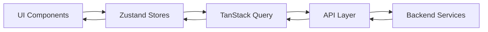

# Application State Management

## 1. Technical Architecture

### 1.1 Data Flow


### 1.2 Store Organization
```
src/
  └── stores/
      ├── domain/
      │   └── domainStore.ts      # Manages active domains (books/games)
      ├── library/
      │   └── sortStore.ts        # Handles sorting and filtering
      ├── search/
      │   └── searchStore.ts      # Manages search history
      └── ui/
          └── themeStore.ts       # Handles theme preferences
```

## 2. Core Implementation

### 2.1 Domain Management
```typescript
interface DomainState {
  currentDomain: DomainType;
  activeDomains: DomainType[];
  setCurrentDomain: (domain: DomainType) => void;
  toggleDomain: (domain: DomainType) => void;
}

export const useDomainStore = create<DomainState>()(
  persist(
    (set) => ({
      currentDomain: 'books',
      activeDomains: ['books', 'games'],
      // Implementation
    }),
    { name: 'domain-storage' }
  )
);
```

### 2.2 Library Organization
```typescript
interface SortState {
  sortCriteria: 'title' | 'publishDate' | 'author' | 'pageCount';
  sortOrder: 'asc' | 'desc';
  activeTab: string;
}

const useSortStore = create<SortState>()(
  persist(
    (set) => ({
      sortCriteria: 'title',
      sortOrder: 'asc',
      activeTab: 'All'
    }),
    { name: 'sort-settings' }
  )
);
```

### 2.3 Search History
```typescript
interface SearchState {
  history: Record<string, SearchEntry>;
  results: Record<number, SearchResult>;
  addToHistory: (query: string, results: SearchResult[]) => void;
}

const useSearchStore = create<SearchState>()(
  persist(
    (set) => ({
      history: {},
      results: {},
      // Implementation with 30-minute cache
    }),
    { name: 'search-history' }
  )
);
```

## 3. Data Storage & Persistence

### 3.1 Persistence Strategy
- Domain preferences: Local storage (permanent)
- Sort settings: Local storage (permanent)
- Search history: Session storage (30-minute cache)
- Theme: Local storage (permanent)

### 3.2 Security Considerations
- No sensitive data in browser storage
- Server validates all requests
- See [Security Documentation](./security.md) for authentication details

## 4. Testing Strategy
```typescript
describe('Library Management', () => {
  test('sort settings persist', () => {
    const { result } = renderHook(() => useSortStore());

    act(() => {
      result.current.setSortCriteria('author');
    });

    expect(result.current.sortCriteria).toBe('author');
  });
});
```

## 5. Common Use Cases

### 5.1 Adding Media Items
1. User initiates add action
2. Server processes request
3. UI updates automatically

### 5.2 Library Management
1. Sort/filter changes apply immediately
2. Data persists between sessions
3. Automatic error recovery
4. Real-time UI updates

## 6. Performance Optimizations
- Automatic state batching
- Query result caching
- Optimistic UI updates
- Lazy loading of data

## References
- [Data Flow Documentation](./data-flow.md)
- [Security Documentation](./security.md)